# Operationalise infrastructure for enterprise-grade machine learning using Kubernetes and Terraform
- [Operationalise infrastructure for enterprise-grade machine learning using Kubernetes and Terraform](#operationalise-infrastructure-for-enterprise-grade-machine-learning-using-kubernetes-and-terraform)
  - [What are Kubernetes and Terraform?](#what-are-kubernetes-and-terraform)
    - [Terraform](#terraform)
    - [Module files](#module-files)
    - [Environment files](#environment-files)
    - [The terraform way](#the-terraform-way)
  - [Automation](#automation)
    - [Security and compliance](#security-and-compliance)
    - [Environment-based workflow triggers](#environment-based-workflow-triggers)
    - [Separately trigger plan and apply workflow jobs](#separately-trigger-plan-and-apply-workflow-jobs)
    - [Zero-Downtime Scaling with Kubernetes and Terraform](#zero-downtime-scaling-with-kubernetes-and-terraform)

Here, I will show how to deploy and manage an infrastructure for an enterprise-grade machine learning platform. This sort of infrastructure is useful to a team of data scientists, machine learning engineers, researchers, etc., to collaborate on large projects.
This infrastructure will use infrastructure-as-code, automation, policy-as-code, and the cloud to achieve this.
The infrastructure will consist of the following:

1. Kubernetes cluster running in the cloud (Azure) to host our platform.
2. MLflow – an open-source platform to build and manage experiments and models (and serve them too).
   Here are some of the tools used:
3. Terraform to create and manage our entire infrastructure as code (infrastructure-as-code).
4. GitHub Action workflows to trigger automated workflows when changes are made.
5. Policy checking tools to check our infrastructure plans against organisational compliance (policy-as-code). For example, to make sure our infrastructure doesn’t break budget or other org-specific policies.

## What are Kubernetes and Terraform?

Kubernetes enables us to run applications in containers that can easily be provisioned, scaled, and updated without downtime (changes can also be reversed without downtime). Crucial because we don’t want any disruptions to the important work carried out by our teams.

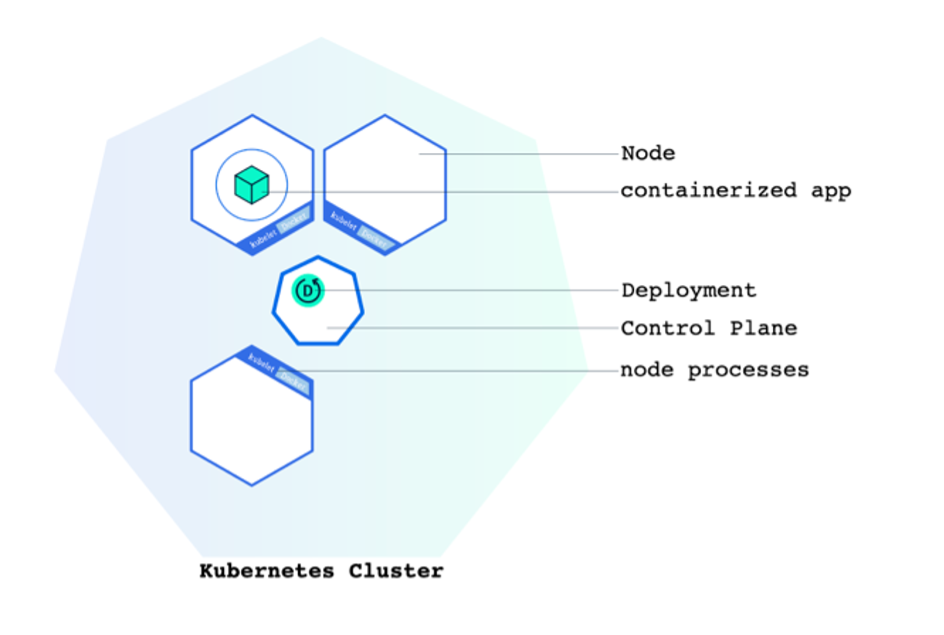

A Kubernetes cluster consists of multiple nodes, each running a containerised instance of our application/software we want to use. The cluster has a control node, which coordinates the cluster’s components, and worker nodes, which contain our application. We can increase the number (horizontal scale) of our nodes, make each of them more powerful in capacity (vertical scaling), or make updates to our containerised apps. All without downtime. This is because changes are applied using rolling updates; Kubernetes gradually replaces old pods with new ones, ensuring that some instances are always running to serve traffic while the update is in progress.

This is an enterprise-scale scenario, so we’ll use a cloud service (Azure) to host and provision our Kubernetes cluster. Our Kubernetes cluster will run in the cloud. With cloud services, we get more robust and streamlined security, high availability, redundancy and integrations with other services.

### Terraform 
This demonstration uses Terraform, which allows us to define, test, and manage our cloud infrastructure as configurable code. Terraform makes it easy to deploy our infrastructure to different cloud services and even makes it possible to deploy our Kubernetes cluster to multiple cloud services simultaneously for additional redundancy and peace of mind should one cloud service fail (this happens more than you think). 

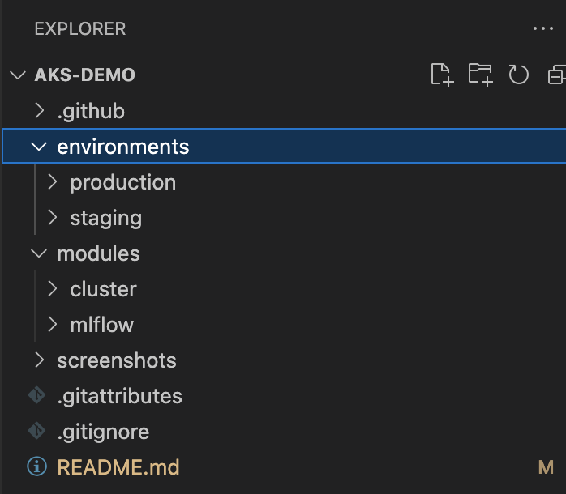

Here, we can see there are two modules (cluster and mlflow) and environments such as production, staging, and dev.  The separate environments enable us to provision our cluster for different purposes. For example, we’d have: 
1.	One environment for engineers to access so they can make changes to the infrastructure (Dev) as needed, 
2.	Another environment to hand-on-test that infrastructure by non-engineers (perhaps a selected group of data scientists)
3.	A final environment for production, which represents the version of the platform that all users use daily.

Our GitHub Actions workflow structure can intelligently switch between environments depending on the branch that is proposing the changes. For example, if the changes are proposed by a branch into the dev environment, then the workflow will point the changes to the correct environment, and so on.
I’ve shown how the overall configuration is structured in terraform, but what do these individual pieces look like? Let’s have a look:

### Module files
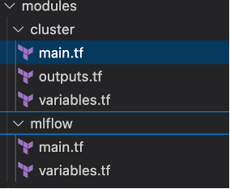

Modules consist of main.tf, varaibles.tf, outputs.tf:
1.	 `Main.tf `: Describes the resource(s) that the model represents. For example, the code below describes our Kubernetes cluster on Azure. Its location is in the East US; it has a node count (virtual machines) of 2, it runs the Kubernetes version we set (1.32.7), and so on.

        ```python
        2.	resource "azurerm_resource_group" "default" {
        3.	  name     = "${var.generic_name}-rg"
        4.	  location = "East US"
        5.	
        6.	  tags = {
        7.	    environment = "Demo"
        8.	  }
        9.	}
        10.	
        11.	resource "azurerm_kubernetes_cluster" "default" {
        12.	  name                = "${var.generic_name}-cluster"
        13.	  location            = azurerm_resource_group.default.location
        14.	  resource_group_name = azurerm_resource_group.default.name
        15.	  dns_prefix          = "${var.generic_name}-dns"
        16.	  kubernetes_version  = "1.32.7"
        17.	
        18.	  default_node_pool {
        19.	    name            = "default"
        20.	    node_count      = 2
        21.	    vm_size         = "Standard_D2s_v3" 
        22.	    os_disk_size_gb = 50
        23.	  }
        24.	
        25.	  service_principal {
        26.	    client_id     = var.appId
        27.	    client_secret = var.password
        28.	  }
        29.	
        30.	  role_based_access_control_enabled = true
        31.	
        32.	}
        ```
        The main.tf for our mlflow module looks like below and specifies the settings for our mlflow service that we want to install in the kubernetes cluster:
        ```python 
        resource "helm_release" "mlflow" {
        name             = "mlflow"
        repository       = "https://community-charts.github.io/helm-charts"
        chart            = "mlflow"
        namespace        = var.namespace
        create_namespace = true
        version          = "1.7.3"
        timeout          = 900
        wait             = true

        values = [
          yamlencode({
            replicaCount = 3 # How many pods (copies of our containerised app) for redundancy/load balancing
            service = {
              type = "LoadBalancer"
            }

            extraEnvVars = {
              # just for testing, never for prod
              MLFLOW_SERVER_CORS_ALLOWED_ORIGINS = "*"
              # just for testing, never for prod
              MLFLOW_SERVER_ALLOWED_HOSTS = "*"
            }
          })
        ]
      }```
2. `Variables.tf` describes the variables available to our module. For example, var.appId, and var.password as seen in the main.tf  These are then provided directly from our GitHub Actions workflow when it triggers the build.

### Environment files
Each environment also has a main.tf, and variables.tf. Except that those represent the configuration our cluster (and other modules) will be provisioned through. For example, here’s the main.tf for one of those environments:

```python
terraform {
  required_providers {
    azurerm = {
      source  = "hashicorp/azurerm"
      version = "~> 4.0"
    }
    kubernetes = {
      source  = "hashicorp/kubernetes"
      version = "~> 2.32"
    }
    helm = {
      source  = "hashicorp/helm"
      version = "~> 3.0"
    }
  }

  required_version = ">= 1.5.0"
}

provider "azurerm" {
  features {}
  resource_provider_registrations = "none"
  subscription_id                 = var.subscription
}

provider "kubernetes" {
  host                   = module.cluster.kube_host
  client_certificate     = base64decode(module.cluster.kube_client_certificate)
  client_key             = base64decode(module.cluster.kube_client_key)
  cluster_ca_certificate = base64decode(module.cluster.kube_cluster_ca_certificate)
}

provider "helm" {
  kubernetes = {
    host                   = module.cluster.kube_host
    client_certificate     = base64decode(module.cluster.kube_client_certificate)
    client_key             = base64decode(module.cluster.kube_client_key)
    cluster_ca_certificate = base64decode(module.cluster.kube_cluster_ca_certificate)
  }
}

module "cluster" {
  source       = "../../modules/cluster"
  appId        = var.appId    # Pass root var to module.
  password     = var.password # Pass root var to module.
  generic_name = var.generic_name
  environment  = var.environment
}

module "mlflow" {
  source     = "../../modules/mlflow"
  namespace  = var.namespace
  depends_on = [module.cluster]
}
```

### The terraform way
With Terraform, we can build our entire infrastructure by opening a command-line tool and running:

```bash
    terraform init
    terraform plan
    terraform validate
    terraform apply
```

(As we'll see later, we can also apply policy checks in this process).

Each of these commands does something different:
1.	Terraform init: Initialises terraform on our machine (fetches the files needed for providers to create the modules and configuration etc.).
2.	Terraform validate: Validates if our configuration is acceptable Terraform settings (no typos, bad configuration etc.)
3.	Terraform plan: This looks at the previous configuration (if there was one) and outlines what will need to be changed, added or removed to achieve our newly described configuration.
4.	Terraform apply: Takes action to apply the configuration plan (if approved) on the target environment.

## Automation 
By implementing GitHub Actions workflows, we can automate the entire Terraform workflow, which means we can maintain consistent infrastructure configuration, catch errors early through automated validation, policy checking, and ensure all changes are reviewed and approved before being applied to our environments: 

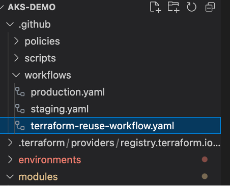

### Security and compliance

Policy checks enable us to enforce security and compliance in our infrastructure with every change. Policies can be broad in their range, from ensuring our resources are encrypted and compliant with budget constraints, to even making sure our configurations don’t break our organisation’s human resources policies, such as preventing deploys on Fridays to prevent overworking into the weekends. This way, all our configurations are created in line with our organisation’s legal and ethical responsibilities.  

We can define policies using tools like terraform-compliance, which each configuration will need to pass before it can be approved for provisioning. For example, here is a policy that ensures our Kubernetes configurations only deploy using certain virtual machine types that don’t break our budget:

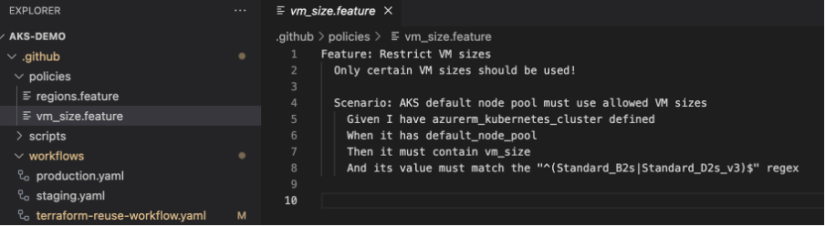

We store our policies in a policies folder at the .github level in the repository, which the workflow can then use for reference when running terraform-compliance. 

### Environment-based workflow triggers
As shown in the image above, we have workflow files for different environments (production.yaml, staging.yaml, etc.). These particular workflow files don’t actually carry out the steps (like validate, plan, apply, etc.). Instead, all they actually do is set the environment for our reusable workflow to run. This way, we have one workflow that is common between environments, and specs for our environments that can be different. 

For example, we can see in the below code that the staging workflow triggers on pushes and pull requests to the staging branch and that it only looks at file changes in the staging environment and modules:

```yaml
name: Terraform staging workflow

on:
  push:
    branches:
      - staging
    paths:
      - "environments/staging/**"
      - "modules/**"
  pull_request:
    branches:
      - staging
    paths:
      - "environments/staging/**"
      - "modules/**"
permissions:
  contents: read
  pull-requests: write
  id-token: write
jobs:
  terraform:
    uses: ./.github/workflows/terraform-reuse-workflow.yaml
    with:
      environment: staging
      working-directory: environments/staging
      plan-label: "latest" # Will be 'latest' on push
```

The other environment workflow files do the same, except that they target the other environments. 

### Separately trigger plan and apply workflow jobs

Our reusable workflow file contains the steps to run both the plan and apply jobs separately.  A plan should never be applied before approval:

1.	We want all plans to be approved by a human being (after passing all checks).
2.	We want plans only to be applied after a PR is merged into a target environment.
The process works like this: suppose a change is being proposed to the staging branch. When the engineer raises a PR, our workflow will trigger our Terraform Plan job:
1.	Create a runner
2.	Install Terraform
3.	Initialise + Validate
4.	Create a plan based on our configuration
5.	Run compliance checks against our plan.
6.	Save our plan on an encrypted remote storage on Azure.


If all steps are completed successfully (no validation fail, policy check fail etc.), then the plan will be shown in the PR for approval:

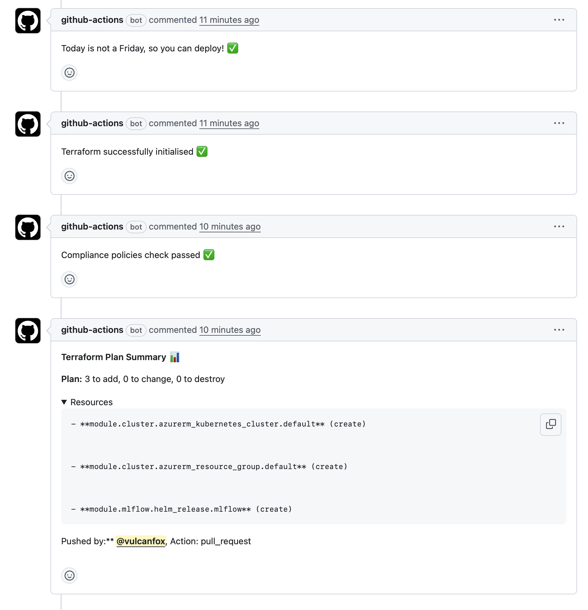

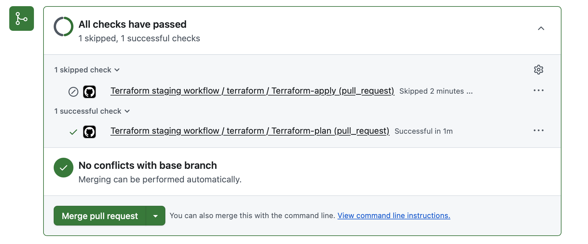


The reviewer can then merge the PR on approval. This will then trigger the apply job separately, which does the following:
1.	Create a runner
2.	Install Terraform
3.	Initialise
4.	Download the stored plan.
5.	Apply the plan (which creates/updates the configuration).
6.	Fetch and show the IP address of the newly updated service: 

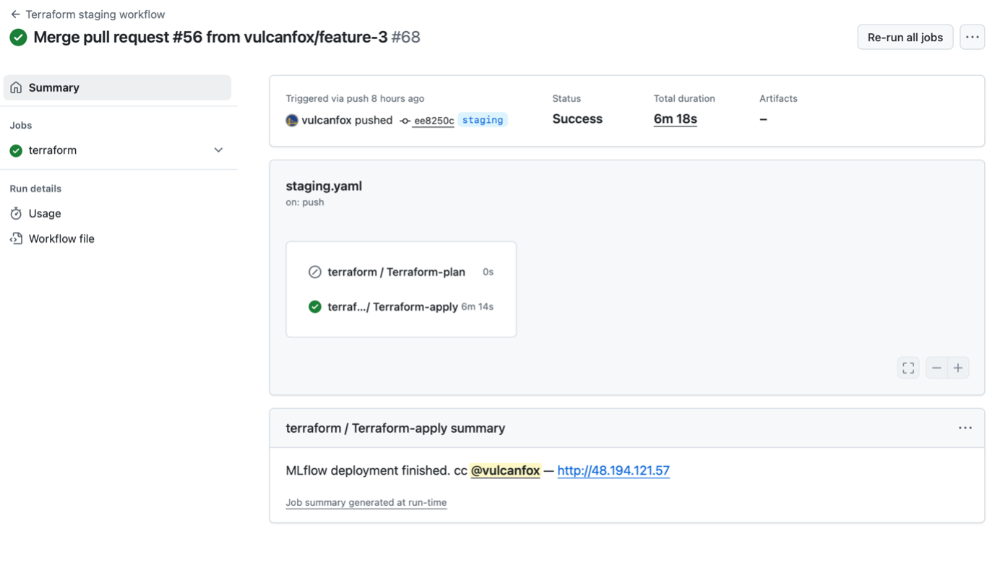

And then we can go to the displayed address using our browser and find our mlflow service in our staging environment all up and running:

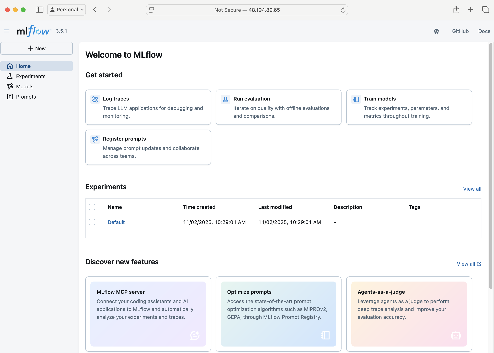

To make propagate our changes to the production environment, we can then simply raise a PR into production from the staging branch for review and approval. 

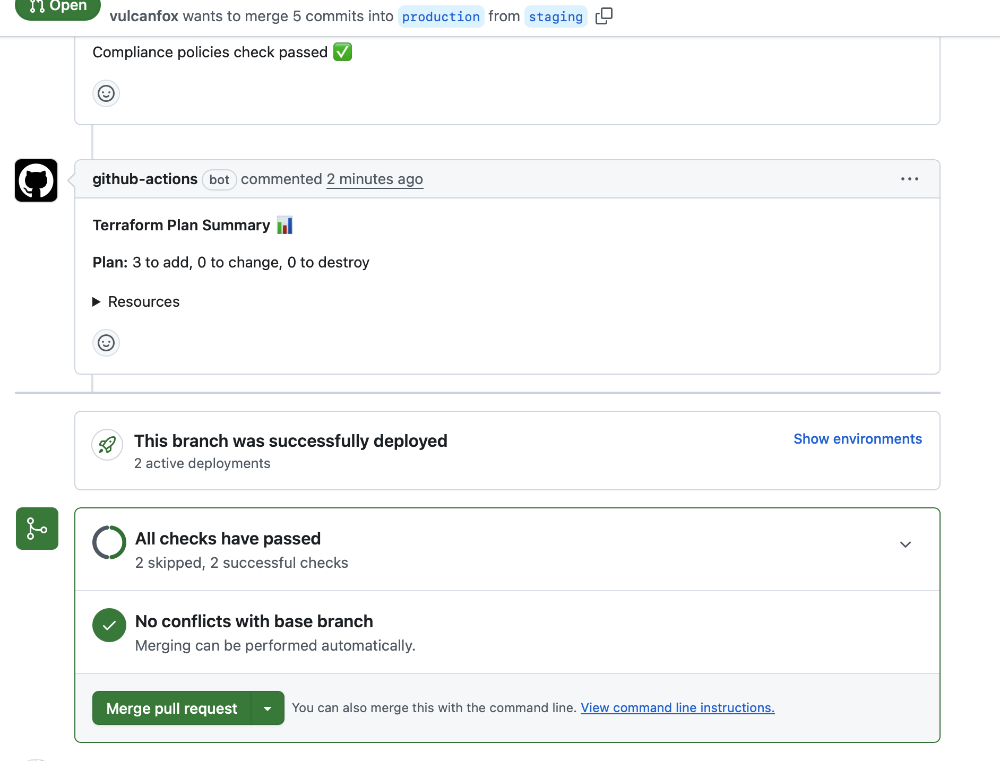

The changes would then  be automatically applied for production.
After the apply job completes, the environment will be accessible from a separate server:

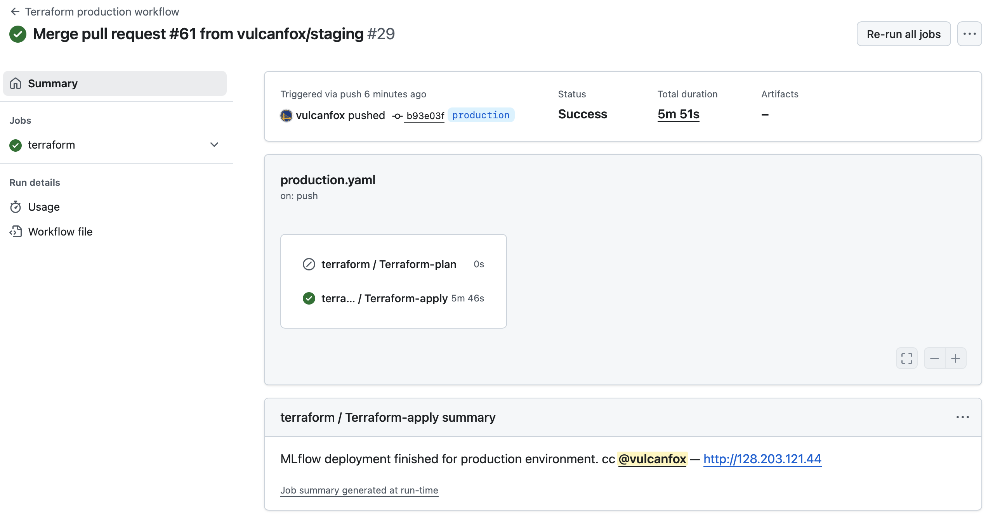


### Zero-Downtime Scaling with Kubernetes and Terraform 
Crucial to remember that, because this is Kubernetes, there is no downtime for the user as configuration changes are applied (depending on what we're changing). 
For example, suppose we increased the number of pods (replicas) in our cluster to improve load balancing/redundancy:
```python
resource "helm_release" "mlflow" {
  name             = "mlflow"
  repository       = "https://community-charts.github.io/helm-charts"
  chart            = "mlflow"
  namespace        = var.namespace
  create_namespace = true
  version          = "1.7.3"
  timeout          = 900
  wait             = true

  values = [
    yamlencode({
      replicaCount = 4 # used to be 3, changed to 4
      service = {
        type = "LoadBalancer"
      }

      extraEnvVars = {
        # just for testing
        MLFLOW_SERVER_CORS_ALLOWED_ORIGINS = "*"
        # just for testing
        MLFLOW_SERVER_ALLOWED_HOSTS = "*"
      }
    })
  ]
}
```
And suppose we also increased the number of nodes for our Kubernetes cluster by changing it from 2 to 3:

```python
resource "azurerm_kubernetes_cluster" "default" {
  name                = "${var.generic_name}-cluster"
  location            = azurerm_resource_group.default.location
  resource_group_name = azurerm_resource_group.default.name
  dns_prefix          = "${var.generic_name}-dns"
  kubernetes_version  = "1.32.7"

  default_node_pool {
    name            = "default"
    node_count      = 3 # Was 2, now we set it to 3!
    vm_size         = "Standard_D2s_v3" 
    os_disk_size_gb = 50
  }

  service_principal {
    client_id     = var.appId
    client_secret = var.password
  }

  role_based_access_control_enabled = true

  tags = {
    environment = "Demo"
  }
}
```


It’s important to note that we could have easily changed this to use autoscaling instead by setting a min/max count for worker nodes:

```python
  default_node_pool {
  name                = "default"
  enable_auto_scaling = true
  min_count           = 2
  max_count           = 5
  vm_size             = "Standard_D2s_v3"
  os_disk_size_gb     = 50
}
```
Once we commit the changes and raise a PR in our environment, the workflow will trigger and create a plan, and if approved, the cluster node size and replica count will be increased for our users of that particular environment without any downtime.
